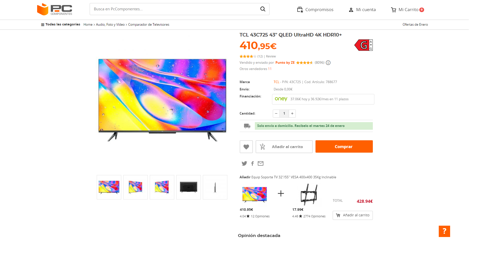
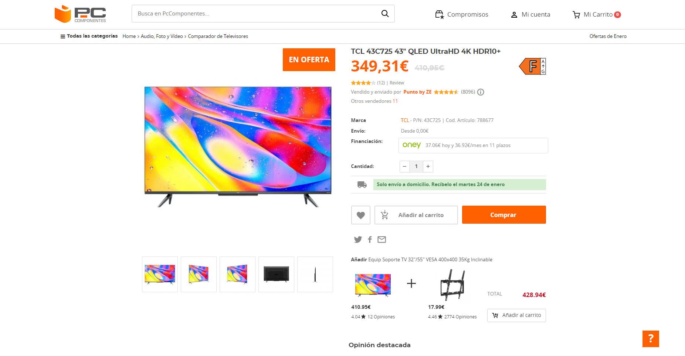

# Taller Svelte Sysmana 2023

---

# Instalación proyecto

Esta es la base de código que usaremos en la charla-taller sobre Svelte en la Sysmana 2023. Para configurar el proyecto correctamente, tienes que tener instalado `git` en tu ordenador y ejecutar los siguientes comandos.

```bash
git clone https://github.com/oschertar/taller-svelte-sysmana.git
cd taller-svelte-sysmana
npm install
```

_Hay que tener [Node.js](https://nodejs.org) instalado previamente para que funcione correctamente._

Una vez hecho esto, ejecutar el siguiente comando y comprobar que no hay ningún error:

```bash
npm run build
```

Empezaremos el taller con esta base de código.

## ¿Qué haremos en el taller?

Modificaremos la web de un producto de uno de nuestros clientes: PCComponentes. Actualmente una página de producto sin descuento se muestra así:



Nos han pedido que hagamos los siguientes cambios:

Producto: [TCL 43C725 43"](https://www.pccomponentes.com/tcl-43c725-43-qled-ultrahd-4k-hdr10)

1. Añadir la etiqueta "En Oferta" en la zona derecha y superior de la imagen del producto.
2. Modificar el estilo del precio actual para que ahora sea el precio anterior (sin descuento). Deberá de estar tachado, de color gris y con un tamaño inferior al nuevo precio.
3. Añadir el nuevo precio a su izquierda con un estilo similar al que ya tienen. Este nuevo precio será el precio actual con un descuento del 85%.
4. Modificar la eficiencia energética de los productos para que muestren eficiencia energética F.

El producto deberá de mostrarse de la siguiente forma:



# Enlace stackblitz repositorio online

[Enlace](https://stackblitz.com/edit/taller-svelte-sysmana-2023-wmhhjg?file=README.md)
